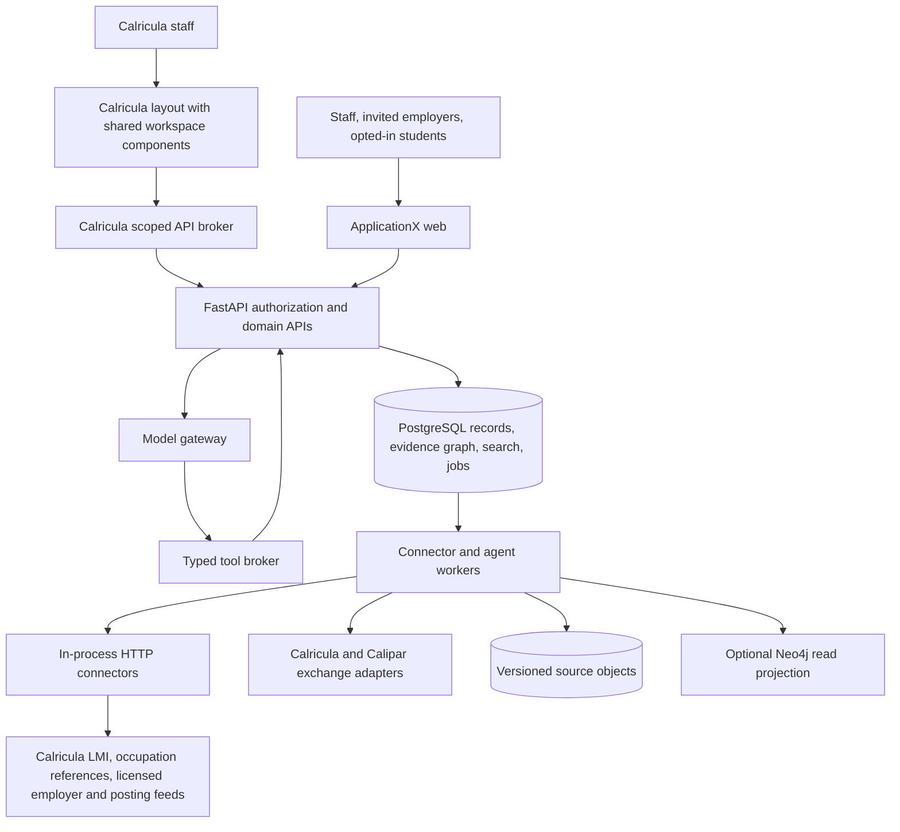

# ApplicationX technical specification

Version: 0.4 | Date: 2026-09-20 | Status: Proposed architecture (P1 implemented)

Requirements: [PRD](PRD.md). Verified source pointers and limits:
[source inventory](SOURCE-INVENTORY.md). Names and API contracts below are proposed
ApplicationX interfaces, not existing endpoints.
The [embedded staff interface](EMBEDDED-INTERFACE.md) is a binding extension of
this specification and defines AX-04.

## 1. Architecture decision

Build a separate Next.js application and FastAPI service with a dedicated
PostgreSQL database. Integrate through typed adapters and revisioned exchange
contracts. Source snapshots, canonical records and approved evidence live outside
the model. Bots act through application APIs with server-enforced authority.
Support two UI hosts: standalone ApplicationX and shared React workspace
components rendered inside Calricula's layout. ApplicationX's backend and data
remain separate in both modes.

| Approach | Tradeoff | Decision |
| --- | --- | --- |
| Separate companion with embedded staff UI, shared contracts and PostgreSQL evidence graph | Integrated staff experience with independent data/access boundaries; needs a versioned UI package and host adapter | Selected |
| Add everything inside Calricula | Less initial app setup; couples employer/student access to curriculum workflows | Rejected for this draft; owner selected companion |
| Separate graph database and multi-agent infrastructure immediately | Rich traversal and independent scaling; more replication and operational failure modes before workload evidence | Defer infrastructure expansion |



## 2. Stack sheet

| Layer | Draft choice | Reason and limit |
| --- | --- | --- |
| Web | Next.js App Router, TypeScript, React, Tailwind v3 | Align with siblings; their inspected Next.js pin is 16.2.9. Verify security/support and lock dependencies at implementation |
| Embedded staff UI | Versioned shared React package with host theme/context/transport adapters | Built into Calricula; no iframe or runtime remote-code dependency |
| Design | Light-only, shared accessible primitives; preserve Calricula/CALIPAR names on integration surfaces | Keyboard-first tasks; small gold text uses Calricula's gold-ink where that theme is reused |
| API | Python 3.12, FastAPI, SQLModel, Pydantic, Alembic | Same runtime as Calricula; schema changes only through migrations |
| Data | PostgreSQL 16, separate ApplicationX DB and app role | Canonical operational store; row security plus domain authorization |
| Graph | Typed entity/relationship/claim tables in PostgreSQL; recursive queries and deterministic Python graph algorithms | Rebuildable evidence model; do not give the LLM arbitrary SQL/Cypher |
| Retrieval | PostgreSQL full-text search and typed queries first; optional pgvector behind retrieval interface after evaluation | Hybrid semantic retrieval is a measured enhancement, not necessary for exact numeric lookups |
| Files | Versioned S3-compatible object storage; filesystem adapter for local development | Preserve source bytes, hashes, permissions, license and deletion lineage; provider selected before hosting |
| Identity | Logto (OIDC) access-token verification via JWKS, app-owned memberships | One shared Logto tenant is the embedded staff sign-in configuration; roles remain app-owned |
| AI | Provider interface with Gemini via google-genai first (P2) | Model ID is deployment configuration and evaluated before release; no model dependency in P1 |
| Optional managed retrieval | Gemini File Search for authorized public/source collections | Disabled for private data by default; do not use a mixed unrestricted collection |
| Background work | Dedicated Python worker with PostgreSQL job table, leases and transactional outbox | One durable source of task state; no Redis requirement initially |
| Connectors | In-process HTTP connectors with typed parameters, allowlisted egress hosts and replay fixtures | No subprocesses, no user-written shell; every source is an explicit exchange |
| Realtime | HTTP writes, SSE for workspace/run/thread events with resumable sequence IDs | No collaborative text CRDT requirement initially; revisions detect conflicts. Calricula's broker relays the stream |
| Telemetry | Content-free structured logs, metrics and internal run history | External tracing optional, explicitly configured; never log credentials or raw private prompts |
| Packaging | Separate API, worker and web containers; Docker Desktop for local use | |

Neo4j and pgvector version/license/deployment choices require implementation-time
validation. No production database, hosting provider, paid subscription or model
account is selected by this document. Do not connect to sibling production or
research databases when developing the new app.

## 3. Proposed implementation boundaries

The sibling repository contains `frontend/`, `backend/app/`, `backend/alembic/`,
`backend/tests/`, `packages/workspace-ui/`, `connectors/data_families.yaml`,
`contracts/schemas/`, `fixtures/synthetic/` and `docs/`.

Within `backend/app/`, use modules with explicit domain responsibilities:

- `identity/`: token validation, organization/workspace membership, sharing policy. (P1)
- `collaboration/`: workspaces and program mappings (P1); threads, messages, tasks, artifacts, approval records (P2).
- `connectors/`: source contracts, in-process connectors, inventory, freshness and coverage. (P1)
- `evidence/`: identity crosswalk (P1); snapshots, claims, graph relationships (P2).
- `employers/`: organizations/locations, contacts, postings, opportunities, feedback. (P2)
- `agents/`: run state machine, budgets, scheduling, authorized tool execution. (P2)
- `integrations/`: revision-safe Calricula/Calipar exchanges. (P2)
- `workers/`: jobs, leases, retries, outbox delivery and index projection. (P2)

Calricula and Calipar receive separately scoped integration changes in their
own plans.

## 4. Canonical data model

All private records require `org_id`, resource ACL and monotonically increasing
`revision`. Public-source records have explicit public classification; public is
never inferred from a missing organization. Internal IDs are UUIDs. External IDs
remain source-qualified strings and are never treated as interchangeable.

| Record | Important fields/invariants |
| --- | --- |
| Organization / Workspace / Membership | External identity issuer+subject; role; resource grants; expiry; membership revision |
| Source | Connector ID, permitted operations, host allowlist, classification, license policy, freshness policy |
| Snapshot | Source ID, source release, observed_at, effective period, artifact hash, schema/connector versions, coverage, storage pointer |
| SourceRecord / Passage | Source-native ID, snapshot ID, content hash, page/section/field locator, ACL, original URL |
| Entity / ExternalIdentity | Type; canonical ID; namespace+external ID+campus/year scope; tentative/confirmed identity mapping |
| Claim | Subject, predicate, object/value, evidence refs, extracted/inferred/confirmed/disputed status, method version, reviewer, valid-time interval |
| ProgramRevision / CourseRevision | Source owner (Calricula), external ID, source revision, campus, catalog year, approved/draft state |
| Objective / Assessment / Skill / Task | Distinct entity types; never equate mention, instruction, assessment and demonstrated competence |
| Employer / EmployerLocation / Contact | Separate organization and location; sourced professional contacts with source vendor, obtained-at, consent/sharing state, opt-out and suppression flags; no student data |
| JobPosting / Opportunity | Source posting ID, employer location, dates, observed status, required/desired skill claims, history coverage |
| Thread / Message / Artifact | Workspace ACL, author type, revision, source refs, share audience, supersession status |
| Approval | Action type, requester/approver, artifact hash, recipients, destination, source and permission revision, expiry |
| AgentRun / ToolCall / Approval | Principal, scope, policy revision, budget, source manifest, output hash, action binding and outcome |
| Job / OutboxEvent / DeliveryReceipt | Idempotency key, lease owner/expiry, attempt count, next-attempt time, destination revision and receipt |
| PrivateStudentProfile / LearningEvidence | P3 only; user ownership, source permission, explicit share grants, retention; excluded from public graph |

Relationship vocabulary includes `PROGRAM_REQUIRES_COURSE`,
`COURSE_HAS_OBJECTIVE`, `OBJECTIVE_ADDRESSES_SKILL`, `ASSESSMENT_TESTS_SKILL`,
`POSTING_REQUESTS_SKILL`, `EMPLOYER_CONFIRMS_TASK`, `OCCUPATION_USES_SKILL`,
`EVIDENCE_SUPPORTS_CLAIM`, `CLAIM_CHALLENGES_CLAIM`, `REVISION_SUPERSEDES`, and
`COURSE_ALIAS_OF`. Approved crosswalks and raw source assertions remain distinct.

SOC, O*NET, NAICS, CIP, TOP, Calricula program/college IDs and employer
directory IDs have explicit namespaces and versioned crosswalks. A ZIP code is
a geographic filter, not an O*NET Job Zone; Job Zone describes occupational
preparation. Preserve the distinction between the industry systems SIC and
NAICS. Licensed posting data is keyed by county/MSA, not ZIP; a ZIP scope is
translated and the translation is shown.

### Identity resolution and conflict handling

Use exact source keys first, curated crosswalks second, and AI/fuzzy candidate
matches last. Candidates require review before use in consequential joins.
Employer name alone cannot merge employers; a directory ID plus location is the
merge key, and a posting's employer string is a candidate until confirmed.
Preserve original records after a merge, support unmerge, and invalidate derived
claims when mappings change.

Field authority is specific: Calricula owns its draft/approval state and its
labor-market lookups; a licensed directory owns an employer's legal name and
NAICS; a posting source owns the posting's dates and text; the employer, once
confirmed, owns its stated hiring needs. Disagreements create conflict records
and warnings. Never apply a generic "newest source wins" rule to all fields.

## 5. Connector contract and coverage

The broker accepts typed operations rather than commands written by the model:

```text
ConnectorRequest {
  operation, principal_context, source_id,
  scope: {organization, campus, term, catalog_year, geography},
  parameters, freshness: live_required|prefer_live|snapshot,
  page_cursor, max_records, deadline_ms
}
ConnectorResult {
  schema_version, status: ok|partial|unavailable|unconfigured|forbidden,
  data, evidence_refs,
  provenance: {source_url, source_mode, snapshot_id, observed_at,
               effective_period, connector_version, artifact_hash},
  coverage: {scope, expected, retrieved, complete, truncated, next_cursor},
  errors: [{code, retryable, safe_message}]
}
```

Unknown expected counts are `null`, never zero. A missing field required by an
operation invalidates that operation's result. A connector validates the
upstream's shape before trusting it; an HTTP 200 alone is not success.

Operations are registered in `app.connectors.registry` with the parameters a
caller may pass and their patterns. Implemented: `lmi.lookup` (Calricula
wages/projections by SOC). Planned in P2: `employers.search/get`,
`postings.search/history`, `occupations.lookup` (O*NET / CareerOneStop) and
`regional.index` (Centers of Excellence / EDD). Every operation belongs to
exactly one connector, and a request whose `source_id` does not own the
operation is refused. Full source and operation families appear in the
inventory.

### Execution isolation

Connectors run in-process with allowlisted egress hosts, no credentials in
URLs, request deadlines and response-size limits. Parameters are validated
against declared patterns and flag-shaped values are refused before anything
reaches an upstream. Deny remote mutation by default. Replay fixtures
(`CONNECTOR_REPLAY`) serve recorded success responses in development and e2e
and are refused in production.

Treat PDFs, web pages, job postings and tool outputs as untrusted evidence, never
as instructions. Fetches restrict protocols/hosts and revalidate redirects;
private network addresses and metadata endpoints are blocked. Parsing runs with
resource limits. Cached data and tool results retain the same ACL as their source.

## 6. Freshness, snapshots and ingestion

Proposed defaults, subject to source access/rate limits:

| Data | Refresh policy | Answer policy |
| --- | --- | --- |
| Curriculum (Calricula) | Approved revision on host context; drafts only when explicitly shared | Bind every claim to the program revision |
| LMI | Source-release-based checks | Display statistical period and geography, not just fetch time |
| Employer directory | Licensed refresh cadence; retain each release | Show the directory release; a missing employer is "not in source", not "does not exist" |
| Employer postings | Daily configured monitor | No promise of instant notifications or complete posting history |
| Regional indexes (COE/EDD) | Source-release-based import | Consumed as published; never recomputed |
| Employer feedback and meetings | Written by people; revisioned | Employer-confirmed statements outrank AI extraction |
| Private student data (P3) | User-authorized request; short private cache | Private scope checked before fetch and reuse; never silently cross users |

Pipeline: acquire → validate shape/scope → store immutable permitted artifact →
normalize → resolve identities → create evidence/claims → review inferred links →
index → publish source-health state. A complete scoped refresh atomically advances
the active snapshot. Partial refreshes do not delete missing records. Closed or
removed postings receive dated status observations rather than disappearing.

When source terms prohibit retaining bytes, preserve the allowed metadata and
mark reproduction limits. Hashes do not substitute for source bytes. Store
valid-time and observed-time separately; preserve corrections and tombstones.

## 7. Assistant execution

Workspace assistants (P2) answer inside an authorized workspace only; there is
no public or anonymous question surface.

1. Verify user context, membership and resource scope.
2. Resolve the program revision, geography and occupations from the workspace;
   ask only when a missing value materially changes the lookup.
3. Route exact facts to structured connectors; descriptive questions use
   authorized document search over workspace evidence. Graph queries return
   evidence paths and uncertainty states.
4. Validate source scope, freshness, coverage and numerical facts before generation.
5. Give the model only authorized results and stable evidence IDs.
6. Validate cited IDs and critical values against results. Unsupported critical
   claims are withheld or answered with explicit unknowns.
7. Stream the answer, typed cards, citations and safe run status. Do not expose
   internal prompts, hidden reasoning, provider credentials or unrestricted traces.

Response contract:

```text
AssistantAnswer {
  message_id, answer, route, resolved_scope,
  cards: [employer|posting|occupation|evidence],
  citations: [{evidence_id, url, locator, source_period, observed_at}],
  warnings: [{code, source_id, message}],
  clarification: null|{slot, choices},
  completeness, run_id
}
```

Source links point to the upstream public record or an authorized in-app
evidence view, not developer filesystem paths. Hidden sources cannot leak
through titles, counts, relationship neighbors, suggested prompts or citations.

## 8. Collaboration and agent execution

All messages and artifacts have a visibility audience. Private and employer-shared
threads are separate resources, not client-side filters. Sharing an artifact
checks all cited evidence for the destination audience; if unauthorized material
contributed, regenerate from permitted inputs before sharing. Do not merely hide
the citation while retaining a sensitive conclusion.

Use ETags or revision tokens for message edits, mapping decisions and approvals.
A stale write returns 409 with an authorized conflict view. Events have ordered
workspace sequence IDs; SSE reconnect resumes from the last authorized event.
Revocation ends active streams and invalidates caches before the next payload.

One coordinator initially runs named research, curriculum, advisory and review
workflows. Optional specialist subruns inherit the intersection of parent scope
and their tool grants. Agents have no independent organizational authority.

```text
queued → running → awaiting_review → approved → executing → completed
                 ↘ completed (read-only/draft-only)
Any nonterminal state → cancelled | failed | expired
```

Approval records bind action type, requester/approver, artifact hash, recipients,
destination, source revision, permission revision and expiry. A content, recipient
or permission change invalidates approval. Cross-app execution rechecks authority
and destination revision immediately before mutation. Approval never implies
Calricula curriculum approval or Calipar review approval.

Default run budgets: 20 tool calls, 5 minutes and a deployment-configured monetary
cap. The monetary cap must be set before paid agents are enabled. At exhaustion,
return partial results and stop; child runs share the parent's budget.
Monitor creation specifies source set, frequency, end date, audience and owner.

Jobs use transactionally persisted states and leases. Workers claim ready work
with row locks, heartbeat the lease and bound retries to three attempts for
retryable failures. Use exponential delay with jitter and provider retry headers.
An outbox commits with the domain change, then dispatches separately. Idempotency
keys prevent duplicate imports. For external delivery without idempotency/readback,
an ambiguous timeout becomes `delivery_unknown` for reconciliation, never a blind
resend. Cancellation stops new calls and reports any already completed side effects.

Agent memory is distinct from institutional evidence. User preferences remain
user-scoped; procedural lessons can be proposed for administrator review. Bots
cannot rewrite shared policy, install tools, or promote conversation claims into
verified facts through a self-improvement loop.

## 9. Cross-application integration contracts

### Ownership and transport

Use HTTPS service APIs with scoped service identities and audit attribution to
the initiating user. Do not join sibling databases or distribute their credentials.
Initial evidence exchange uses downloaded/imported packages; automated package
delivery is enabled only after receiver support is implemented and tested.
Separately, the embedded UI requires authenticated API transport and context
resolution as defined in the embedded-interface design; both are implemented.

An exchange package has `schema_version`, `package_id`, origin app and organization,
destination app and organization, initiating actor reference, purpose, exact source
IDs/revisions, evidence manifest, proposed action, audience, created_at, expires_at
and artifact hash. Receiver validates organization mapping, authority, schema,
revision and evidence access, returning accepted/rejected/conflict plus a receipt.

| Direction | Contract |
| --- | --- |
| Calricula → ApplicationX | Approved program/course snapshot by default; draft only with explicit sharing; objectives, hours, requirements, SLOs and source revision |
| ApplicationX → Calricula | Proposed curriculum review artifact plus reviewed skill mappings; creates a draft review item, never overwrites an approved COR |
| Calipar → ApplicationX | Explicitly shared review goals/questions and program identity; no unrestricted reviews or resource-budget dump |
| ApplicationX → Calipar | Evidence narrative, denominators, employer feedback and proposed action; receiver creates draft review/action content |

Neither sibling currently implements this exchange protocol. If receiver revision
changed, return conflict and ask staff to rebase the proposal. A receiver must
deduplicate `package_id` and return the prior receipt on safe retry. Refresh imports
through cursor-based reconciliation; webhooks later supplement reconciliation,
with signature, timestamp and replay validation.

### Proposed ApplicationX HTTP surface

| Endpoint family | Purpose |
| --- | --- |
| `POST /v1/host-contexts/resolve` | Check caller access and map exact host program/revision to an authorized workspace; no implicit provisioning (implemented) |
| `GET /v1/sources`, `GET /v1/sources/{id}/health` | Authorized coverage and freshness (implemented) |
| `GET /v1/workspaces/{id}/events` | Resumable workspace event stream (P2) |
| `/v1/workspaces/{id}/threads`, `/tasks`, `/artifacts` | Collaboration with revision checks |
| `GET /v1/evidence/{id}`, `POST /v1/graph/queries` | Cited records and allowlisted graph questions |
| `/v1/employers`, `/opportunities`, `/feedback` | Scoped employer records and evidence |
| `POST /v1/agent-runs`, `POST /v1/agent-runs/{id}/cancel` | Bounded execution and interruption |
| `POST /v1/approvals`, `POST /v1/monitors` | Concrete action authorization and ongoing jobs |
| `POST /v1/exchanges`, `GET /v1/exchanges/{id}` | Validate and deliver integration packages |

Mutating endpoints require server-derived principal context and idempotency keys.
Resource IDs never substitute for authorization. Errors distinguish forbidden,
stale revision, unavailable source, incomplete coverage and invalid contract.

## 10. Security, privacy and retention design

Verify Logto access tokens on the backend (PyJWT + JWKS) using the configured issuer/audience and
current SDK. Use app memberships for authorization; revocation checks are required
for sensitive operations. Public mode has a separate principal with public-only
grants. A production configuration must refuse any development auth bypass.
[Logto access-token validation](https://docs.logto.io/authorization/validate-access-tokens); see ADR-0001.

Enable PostgreSQL row-level security on private tables and use a non-owner app
role without BYPASSRLS. Migration/admin roles are separate; pooled connections
set principal scope transaction-locally and clear it at transaction end. RLS is
defense in depth; application policy still enforces field and action restrictions.
Test owner/service-role bypass risks explicitly.
[PostgreSQL row security](https://www.postgresql.org/docs/16/ddl-rowsecurity.html).

Only provider-approved data classes may enter a model request. Student profiles,
placement records and employer-private information are denied to external
model/retrieval providers by default. A private feature's
launch requires an explicit permitted-field/provider configuration and institution
authorization. Do not use another user's credentials or a shared personal token.

Managed File Search is optional and must use collections appropriate to visibility
scope; ApplicationX still authorizes every query and citation. Deletion and grant
revocation must also remove derived retrieval access, not just an application row.
[Gemini File Search](https://ai.google.dev/gemini-api/docs/file-search).

Employer contact records honor opt-out and suppression flags in every outreach
path, record their source and obtained-at date, and are removed on a
downstream deletion request from a registered data broker.

Default proposed retention: workspace assistant threads 30 days after the
workspace is archived; content-free run diagnostics 30 days; operational
approval/audit metadata 365 days. Source evidence and shared
institutional artifacts follow an organization-set schedule established before
real-data onboarding. These are engineering defaults, not legal determinations.
Audit records retain hashes/action metadata rather than deleted private content.

Deletion immediately denies reads and schedules removal from objects, search,
graph projections and configured providers within 24 hours. Backups expire within
a configured maximum of 30 days; restore reapplies tombstones before serving.
Exceptions such as an authorized retention hold are explicit and visible to the
relevant administrator. Keep student data out of public source trees and fixtures.

## 11. Optional Neo4j projection

Add Neo4j only if a representative, permission-aware workload fails the initial
query target after PostgreSQL indexing and bounded traversal optimization. Target:
p95 under 2 seconds for the five core graph questions at 100,000 entities and
1,000,000 claims on the chosen pilot hardware. These are test dimensions, not a
forecast. Measure PostgreSQL and the candidate projection against the same data.

PostgreSQL remains canonical. An outbox-backed projector writes versioned graph
records with monotonic event IDs; idempotent replay and tombstones support rebuild.
Only public records enter the first external graph projection. Private relationships
remain in PostgreSQL until equivalent authorization has separate acceptance tests.
Use a dedicated instance, ports and volumes.

Graph queries return source IDs, evidence paths, status and freshness. Cap depth,
result size and execution time. Rebuilding the graph must not change approved
institutional records or invent newly confirmed relationships.

## 12. Verification and rollout gates

Map every PRD requirement to an implementation-plan task and the cases below.

| Area | Required acceptance cases |
| --- | --- |
| Connector contract (AX-02,03,10) | Each inventory data family classified; fixture per operation; success/empty/partial/error; field and license preservation; release period and geography on every value |
| Graph (AX-06) | Exact vs inferred identity, disputed claims, source revision change, unmerge, valid/observed time, evidence deletion and reproducible bounded query |
| Employers (AX-05) | Distinct branches with similar names, duplicate postings, required vs desired skills, posting removal, unknown history coverage, explainable ranking, no inferred hiring probability, suppression honored in every outreach path |
| Collaboration (AX-01,07) | Two organizations, employer guest, private student; hidden counts/citations; stream revocation; concurrent edit; safe sharing of derived artifact |
| Embedded interface (AX-04) | In-layout navigation; sign-in reuse; missing access/mapping; wrong org/revision; context switching with late events; reload/back; unsaved edits; sign-out/revocation; accessible narrow-screen view; backend outage and UI/API mismatch |
| Agents (AX-08) | Revoked principal during job, malicious source instruction, invalid approval hash, changed recipient, cost cap, crash/retry/cancel and ambiguous delivery |
| Exchanges (AX-09) | Receiver stub plus real adapter staging; duplicate package, unauthorized org, stale target revision, rejected evidence, partial outage and receipt readback |
| Private workflows (AX-11) | Student opt-in/revocation, purpose/field limits, deletion propagation, no employer access to raw student records |
| Accessibility (AX-13) | Keyboard/screen-reader journeys, focus after streaming, status announcements, semantic tables, graph alternatives, contrast and reduced motion |

For AX-12 competency pilots, store the assessment/rubric revision, assisted versus
independent conditions, time measure, cohort denominator, missing follow-up and
reviewer judgment. An AI-exposure score or lab-hour share cannot serve as a
competency outcome. Compare pilot results only when assessment conditions and
source versions are recorded.

Run synthetic fixture tests before live checks. Provider smoke tests require
explicit configured scope and limited calls; they do not certify complete coverage.
Do not reuse historic live counts as current acceptance expectations.

When implementation changes Calricula, run its backend pytest coverage gate
(45%), frontend build and Jest; migrations require upgrade and boot. Calipar
changes require its own documented gates. Documentation-only work does not need
database-backed app tests.

Roll out by connector and organization feature flags. An unhealthy graph falls
back to scoped structured queries; an unavailable provider never triggers a
less-restricted model route. Rollback disables the new surface/workers and keeps
canonical data; migrations use expand/contract sequencing and a tested backup
restore. Initial pilot operational targets are RPO 24 hours and RTO 8 hours,
validated in a restore exercise before production onboarding.

## 13. Decisions required before implementation/release

- Before P2: select the pilot institution and programs; approve manual employer
  entry as the first source; decide whether the CTE compliance evidence
  requirement (advisory roster, meeting records, needs-assessment export) enters
  scope; set the monetary cap before paid agents are enabled.
- Before employer-feed activation: confirm provider access, allowed retention,
  data-broker registration and deletion flow-down, and source coverage; manual
  sourced entries remain the P2 default.
- Before P3: configure institutional private-data permissions, user credential
  flow, data retention and permitted model processing. No SIS connector is assumed.
- Before P4: benchmark any graph-store change.

These are concrete phase gates. The draft makes no claim that they have already
been satisfied and does not require them to complete the planning documents.
